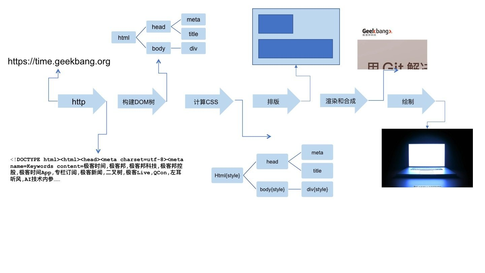
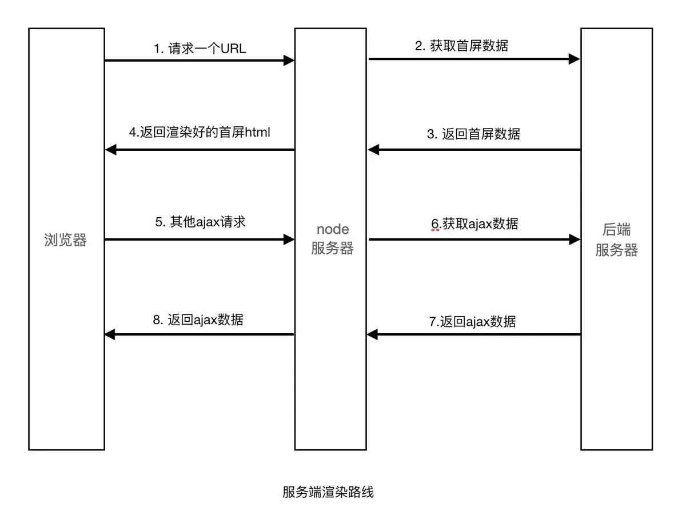
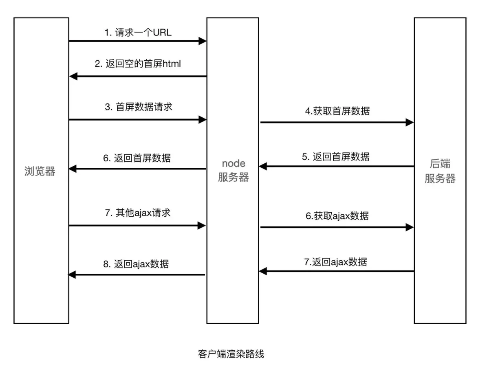
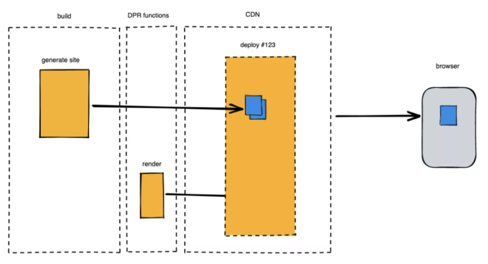

## 输入url之后发生了什么
- DNS域名解析；
- 建立TCP连接；
- 发送HTTP请求；
- 服务器处理请求；
- 返回响应结果；
- 关闭TCP连接；
- 浏览器解析HTML；

 

## 什么是CSR？什么是SSR？
SSR就是Server-Side Rendering，即服务端渲染。
简单理解是将组件或页面通过服务器生成html字符串，再发送到浏览器，最后将静态标记"混合"为客户端上完全交互的应用程序。在服务端完成大部分渲染工作，JSP/PHP前一个前端时代，在服务端生成完整的html页面，其实这就是一开始还没有如今的前端的时候，页面的呈现方式——服务器在响应站点访问请求的时候，就已经渲染好可供呈现的页面。但不同于刀耕火种时代通过后端模板之类方案生成页面，如今的 SSR 能力已经越来越强大，部分情况下甚至能做到“开发者低感知”的状态——开发 SSR 与 CSR 项目并没有太多不同.
 
  
CSR就是Client-Side Render，即客户端渲染。CSR全称是 Client Side Rendering ，代表的是客户端渲染。顾名思义，就是在渲染工作在客户端（浏览器）进行，而不是在服务器端进行。举个例子，我们平时用vue，react等框架开发的项目，都是先下载html文档（不是最终的完全的html），然后下载js来执行渲染出页面结果。
 

## SSR与CSR的区别
- CSR浏览器渲染的步骤：  
用户输入地址，客户端向服务器发送请求 => 
服务器传给浏览器相应的网页文件 => 
浏览器解析文件 => 
遇到ajax请求则向服务器再次请求一些数据 =>
服务器再次向浏览器发送相应的数据 => 
浏览器拿到ajax请求返回的数据后，将数据渲染在页面上

- SSR服务器渲染的步骤就是：  
客户端向服务器发送一次请求 => 
服务器接收请求，并在服务端操作网页文件，将对应数据导入文件 => 
服务器在服务端渲染好整个网页，发送给客户端 => 
客户端接收服务器发送过来的网页文件，不需要做任何操作，直接呈现

## 如何区分SSR与CSR
- 若页面做整体的刷新，即网址发生改变，就是服务器渲染 若页面做了局部刷新，即网址没发生改变，就是客户端渲染
- 若查看网页源代码时，查找不到网页中的一些内容，那就是客户端渲染 若查看网页源代码时，能找到网页中对应的内容，那就是服务器渲染
- 查看返回

## SSR与CSR特点
- CSR
    - 优点  
        1. UI 库支持：常用 UI 方案如 React、Vue，默认的应用形态都是 SPA (for Single Page Application)，是交互程度高、动态化强的 Web 应用，CSR 很好地满足了这种应用形态的需要，并在主流技术栈中拥有广泛支持；
        2. 前后端分离：视图交互和具体数据解耦，有赖于这种应用形态的出现和普及，做到前后端职能清晰明确，更容易维护与协作；
        3. 可以向用户快速展示页面的内容，增加用户体验，单页面应用局部渲染
        4. 给别人爬/虫爬取相应的内容增加一定的困难不同爬虫工作原理类似，只会爬取源码，不会执行网站的任何脚本（Google除外，据说Googlebot可以运行javaScript）。使用了React或者其它MVVM框架之后，页面大多数DOM元素都是在客户端根据js动态生成，可供爬虫抓取分析的内容大大减少。另外，浏览器爬虫不会等待我们的数据完成之后再去抓取我们的页面数据。服务端渲染返回给客户端的是已经获取了异步数据并执行JavaScript脚本的最终HTML，网络爬中就可以抓取到完整页面的信息。
        5. 服务器压力变轻了，渲染工作在客户端进行，服务器直接返回不加工的html。用户在后续访问操作体验好
    - 缺点  
        1. 可能需要向服务器请求多次数据。不利于SEO 搜索引擎优化，即百度、搜狗等搜索引擎搜索不到客户端渲染的数据首屏渲染慢，会出现白屏
- SSR
    - 优点
        1. 只需要向服务器请求一次
        2. 首屏渲染快
        3. 由服务端请求首屏数据，而不是客户端请求首屏数据，这是“快”的一个主要原因。服务端在内网进行请求，数据响应速度快。客户端在不同网络环境进行数据请求，且外网http请求开销大，导致时间差。
        4. 利于SEO 搜索引擎优化，即能被搜索引擎搜索到，能向用户展示你网页的东西

    - 缺点
        1. 如果数据量过大，在服务器渲染的时间就会过长，造成浏览器暂时的空白。对比 CSR 只需要响应早已准备好的空页面，SSR 在完成访问响应的时候需要做更多的计算和生成工作，因此其请求响应时间更长，同时还受限于前置数据接口的响应速度，一项关键指标 TTFB (Time To First Byte) 将变得更大；
        2. 容易被爬虫爬取
        3. 服务端压力较大。本来是通过客户端完成渲染，现在统一到服务端node服务去做。尤其是高并发访问的情况，会大量占用服务端CPU资源；
        4. 开发条件受限。在服务端渲染中，只会执行到componentDidMount之前的生命周期钩子，因此项目引用的第三方的库也不可用其它生命周期钩子，这对引用库的选择产生了很大的限制；
        5. 学习成本相对较高。除了对webpack、React要熟悉，还需要掌握node、Koa2等相关技术。相对于客户端渲染，项目构建、部署过程更加复杂。
        6. 用户体验不好，每次跳转到新页面都需要在重新服务端渲染整个页面，不能只渲染可变区域首屏交互不佳：又是那句话，“SSR 的用户启动体验好，但不完全好”。虽然 SSR 可以让页面请求响应后更快在浏览器上渲染出来，但在首帧出现，需要客户端加载激活的逻辑代码（如事件绑定）还没有初始化完毕的时候，其实是不可交互的状态，同样影响用户体验；
        7. 很难做到局部渲染，无法只渲染可变应用。单页面应用多是CSR。

## 总结 
- 客户端渲染：
页面的渲染工作都是由浏览器来完成的，服务器只是负责提供数据。
不容易被爬虫爬取数据，同时也无法被搜索引擎搜索到
- 服务器渲染：
页面渲染的工作都是由服务端来完成的，数据也是由服务端提供的，浏览器只负责展示页面内容
服务端渲染能尽早的把页面展示给用户，用户体验好
容易被爬虫爬取数据，同时能被搜索引擎搜索到，能在搜索引擎中向用户展示数据

## 扩展
- 扩展：预渲染（Pre Render）  
预渲染与服务端渲染唯一的不同点在于渲染时机，服务端渲染的时机是在用户访问时执行渲染（即服务时渲染，数据一般是最新的），预渲染的时机是在项目构建时，当用户访问时，数据不一定是最新的（如果数据没有实时性，则可以直接考虑预渲染）。

- 预渲染（Pre Render）   
在构建时执行渲染，将渲染后的 HTML 片段生成静态 HTML 文件。无需使用 web 服务器实时动态编译 HTML，适用于静态站点生成。
next.js的官方认为SSR与SSG皆属于pre-rendering的一种技术，听起来其实也挺合理的，。因为使用者都是能够拿到已经渲染资料的HTML档案，所以称作pre-rendering也说得过去

- 扩展： NSR for Native Side Rendering   
Native 就是客户端，万物皆可分布式，可以理解为这就是一种分布式的 SSR，不过这里的渲染工作交给了客户端去做而不是远端服务器。在用户即将访问页面的上级页面预取页面数据，由客户端缓存 HTML 结构，以达到用户真正访问时快速响应的效果。NSR 见于各种移动端 + Webview 的 Hybrid 场景，是需要页面与客户端研发协作的一种优化手段。

- 扩展： ESR for Edge Side Rendering   
Edge 就是边缘，类比前面的各种 XSR，ESR 就是将渲染工作交给边缘服务器节点，常见的就是 CDN 的边缘节点。这个方案主打的是边缘节点相比核心服务器与用户的距离优势，利用了 CDN 分级缓存的概念，渲染和内容填充也可以是分级进行并缓存下来的。
ESR 之下静态内容与动态内容是分流的，边缘 CDN 节点可以将静态页面内容先响应给用户，然后再自己发起动态内容请求，得到核心服务器响应之后再返回给用户，是在大型网络架构下非常极致的一种优化，但这也就依赖更庞大的技术基建体系了。

- 扩展：静态站点生成（SSG）    
SSG全称是 Static Site Generation ，代表的是静态站点生成。在构建的时候直接把结果页面输出html到磁盘，每次访问直接把html返回给客户端，相当于一个静态资源。说它是缝合怪，是因为它与 CSR 一样，只需要页面托管，不需要真正编写并部署服务端，页面资源在编译完成部署之前就已经确定；但它又与 SSR 一样，属于一种 Prerender 预渲染操作，即在用户浏览器得到页面响应之前，页面内容和结构就已经渲染好了。当然形式和特征来看，它更接近 SSR。不同于把大部分渲染工作留到请求时做的 CSR 和 SSR，SSG 在站点项目构建部署的时候，就把页面内容大致填充好了。SSG 兼收了传统 CSR 和 SSR 的优点的同时，对这两者的短板也做到较好的互补。服务负担低、加载性能与体验佳、SEO 友好，这些 SSG 的取各家之长的优势此处不必单独分析，但还有一些好处源自这个模式本身：
    - 优点
减轻服务器压力，可以把生成的静态资源（html）放到CDN上，合理利用缓存
有利于SEO，由于html已经提前生成好，不需要服务端和客户端去渲染
页面内容都是静态生成过的，页面部署只需要简单的页面托管服务器，甚至只需要放在 CDN 之上，大量减少了动态性，还有服务器对页面加载、渲染工作的干预，也就让恶意攻击少了很多可乘之机；

    - 缺点
随着应用的拓展和复杂化，预渲染页面的数量增长速度很快。SSG 项目有较高的构建和部署开销，应用越复杂，需要构建出来的静态页面就会越多，对于功能丰富的大型站点，每次构建需要渲染成千上万个页面都是有可能的，这必然带来较高的部署、更新成本；
只适用于静态数据，对于经常改动的数据，需要每次重新生成页面。高度静态化带来非即时性，用户访问到的页面内 SSG 生成的部分，确保有效性的时间节点是上一次构建，使该模式下的应用失去了部分时效性，这部分缺陷需要通过定时构建、或者部分非 SSG 来弥补，这也是 SSG 的主要问题。
用户体验不好，每次打开新页面都需要重新渲染整个页面，不能只渲染可变区域

- 扩展：增量式渲染（ISR）
ISR全称是Incremental Site Rendering，关键性的页面（如网站首页、热点数据等）预渲染为静态页面，缓存至 CDN，保证最佳的访问性能；非关键性的页面（如流量很少的老旧内容）先响应 fallback 内容，然后浏览器渲染（CSR）为实际数据；同时对页面进行异步预渲染，之后缓存至 CDN，提升后续用户访问的性能。

    - 缺点
对于没有预渲染的页面，用户首次访问将会看到一个 fallback 页面，此时服务端才开始渲染页面，直到渲染完毕。这就导致用户体验上的不一致。
对于已经被预渲染的页面，用户直接从 CDN 加载，但这些页面可能是已经过期的，甚至过期很久的，只有在用户刷新一次，第二次访问之后，才能看到新的数据。对于电商这样的场景而言，是不可接受的（比如商品已经卖完了，但用户看到的过期数据上显示还有）。

- 扩展：分布式的持续渲染（DPR）  
DPR就是Distributed Persistent Rendering，分布式渲染。DPR 是一家云计算公司 Netlify 在一年前 (2021/04) 才发出的一个 「新提案」，它是基于 ISR 基本模型的一种升级，也是针对 ISR 在即时性上的不足的优化。去除了 fallback 行为，而是直接用 On-demand Builder（按需构建器）来响应未经过预渲染的页面，然后将结果缓存至 CDN；数据页面过期时，不再响应过期的缓存页面，而是 CDN 回源到 Builder 上，渲染出最新的数据；每次发布新版本时，自动清除 CDN 的缓存数据。
 

    左边虚线框是构建过程，中间 DPR functions 可以是一些 Serverless 的或是在核心页面服务器上的按需构建函数，然后是 CDN 缓存节点，最后到用户浏览器。Build 阶段就会完成 generate site 的操作，这一步并不会完成所有构建，而只生成关键部分的资源，部署到页面托管服务或者 CDN 之上。而对于其他内容，有一个按需处理的过程—— CDN 会在收到首个访问请求的时候实时要求构建，并将最新构建结果返回给用户，同时将这部分内容加入原有缓存资源中。缓存的资源也会在下一次构建更新的时候被失效。

    缺点   
    新页面的访问可能会触发 On-demand Builder 同步渲染，导致当次请求的响应时间比较长；比较难防御 DoS 攻击，因为攻击者可能会大量访问新页面，导致 Builder 被大量并行地运行，这里需要平台方实现 Builder 的归一化和串行运行。

- 扩展：快照渲染（SR）  
快照渲染在终端上不算一个新的概念，比如手淘的首页就有快照的机制，每次进入手淘会首先展示上一次的页面。Rax 快照渲染结合自适应复合渲染，其让快照渲染的体验变的更快更自然。
Rax 快照技术同样也需要有前置的历史状态，使用快照技术时我们可以把任何时候的页面状态存储为快照，然后下一次加载页面时首先从本地存储中加载上一次的页面快照。加载完快照后我们需要更新到最新的状态，在以往的技术方案中，当新页面完成后先置空为了体验设置的当前快照页面，然后再设置最新页面，这个过程有可能会触发页面的闪动。但通过 Rax 自适应复合渲染方式更新快照到最新的状态则可以避免此问题，这也是 Rax Hydration 把兼容性作为一个重要设计目标的带来的好处。

 
参考链接  
mijs——服务端渲染（SSR）
服务端渲染(SSR)
浅谈服务端渲染(SSR)
渲染篇 1：服务端渲染的探索与实践
服务端渲染SSR及实现原理
vue文-ssr
CSR，SSR和SSG是什么，有什么优缺点？
SSR、CSR、ISR、SSG你还傻傻分不清！
Umijs——服务端渲染（SSR）
CSR和SSR（更新中）
2020年的双11，阿里需要什么样的渲染方案？