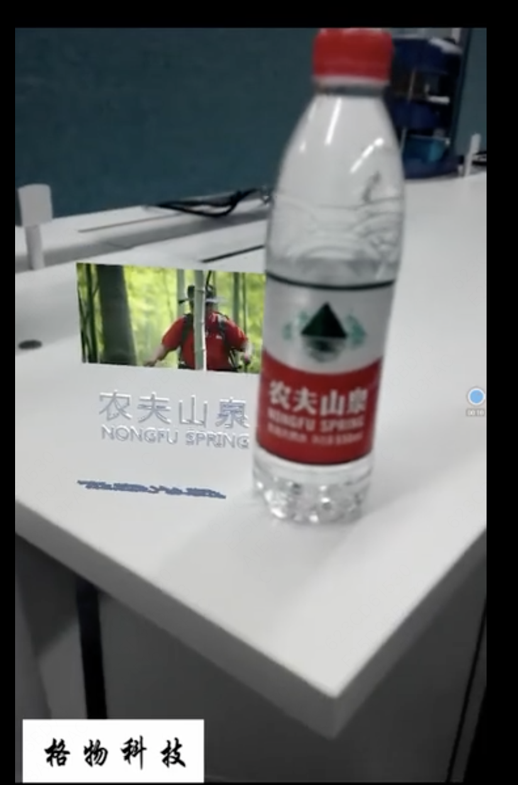

## 前言

6月6日凌晨，苹果公司发布旗下首款MR（混合现实）设备Vision Pro，售价3499美元，折合近2.5万元人民币。又将XR（扩展现实）的讨论带到了一个新的高潮。Apple Vision Pro是否能带我们进入空间计算时代还是个未知数。  
我们看到现在大部分vr场景都是通过app实现的，其实web也能实现vr与ar，今天想介绍的是webXR，也就是网页端AR/VR技术。  
 

概念介绍
- AR 增强现实  
AR（Augmented Reality）增强现实是一种将虚拟信息与现实世界相结合的技术。通过AR技术，用户可以通过智能手机、平板电脑或其他设备，将虚拟信息叠加在现实世界中，从而增强用户的感知体验。目前广泛应用在广告宣传当中。  
示例1：AR游戏精灵宝可梦go，游戏中的宝可梦是根据现实世界的地理位置而生成的，因此玩家需要在现实世界中移动，探索不同的地点，利用摄像头发现更多的宝可梦。  
 
虚拟信息叠加在现实世界，虚拟信息：宝可梦，现实时间：地图。  
示例2：AR农夫山泉广告，https://www.bilibili.com/video/BV1Vx411u7Jf/?vd_source=47ab9d9b05b88f26967bfdc2715f9a93
 

- VR 虚拟现实  
VR（Virtual Reality）虚拟现实是一种通过计算机技术模拟出的仿真环境，让用户可以身临其境地感受到虚拟环境中的场景和体验。目前大多用在vr游戏上。  
示例1：VR游戏
 

- MR 混合现实  
MR（Mixed Reality，混合现实）是一种新型的虚拟现实技术，它将虚拟现实（VR）技术和增强现实技术（AR）结合起来，实现了虚拟和现实的混合。MR 技术可以将虚拟物体与现实环境进行融合，使用户可以在现实环境中看到虚拟物体，并与之进行交互。

- XR 扩展现实  
XR（Extended Reality，扩展现实）是一个更加广泛的概念，包括了虚拟现实（VR）、增强现实（AR）和混合现实（MR）等多种技术。XR 技术的目标是将虚拟和现实进行融合，创造出更加真实、更加逼真的体验。由于开发者不想局限于 VR 或 AR（或两者之间的任何事物）的一个方面，使用了“X”，不是作为首字母缩略词的一部分，而是作为一种代数变量来表示 ，但实际上 X 是您想要的任何东西

## webXR 发展

- WebVR的推出  
WebVR API 于 2014 年春季由来自Mozilla的Vladimir Vukićević首次构思。API 的贡献者包括 Brandon Jones (Google)、Boris Smus 和 Mozilla 团队的其他人。2016年3月1日，Mozilla VR团队和Google Chrome小组宣布推出WebVR API提案的1.0版本。WebVR是一项实验性的JavaScript API，可以利用网页浏览器提供支持各种虚拟现实设备（如HTC Vive、Oculus Rift或Google Cardboard）。  
Web AR 当时还是一项前沿技术，没有标准也没有成熟的库供使用，不过已经有大公司和一部分开发者正在积极推进。WebVR 规范中的部分 API 对 Web AR 也同样适用。比如 VRDevicePose 可以获取摄像头位置。这是当时唯一接近 Web AR 的标准，有了标准我们就可以只针对规范的接口做开发，从而适应绝大多数的设备。 
 
 
- WebXR 取代 WebVR  
WebXR于2018年推出，是一种新的API标准，供web开发人员创建VR或AR应用程序，无需直接与每个硬件打交道。用户只需使用网络浏览器即可开始观看VR/AR内容，无需安装额外的插件或软件。现已包含在Chrome版本79中基于MDN。这个标准实际上是一组 WebXR Device API，它们实现了 WebXR 功能集的核心，管理输出设备的选择，以适当的帧速率将3D场景呈现给所选设备，并管理使用输入控制器创建的运动矢量。  
WebXR 兼容性设备包括沉浸式3D运动和定位跟踪耳机，通过框架覆盖在真实世界场景之上的眼镜，以及手机，它们通过用摄像机捕捉世界来增强现实，并通过计算机生成的图像增强场景。  
为了完成这些事情，WebXR Device API 提供了以下关键功能：  
    - 查找兼容的VR或AR输出设备
    - 以适当的帧率将3D场景渲染到设备
    - （可选）将输出镜像到2D显示器
    - 创建代表输入控件运动的向量
 

## webXR生态  

为了推动WebVR发展，开发者开发了很多工具来降低webXR开发者的入门门槛，完善webxr生态系统。  
- Supermedium  
Supermedium是轻量化的VR浏览器。Supermedium是一个允许你与Web VR内容交互的远程VR浏览器。2019年，同名的开发团队表示团队已经不再积极地继续项目的开发，而是转向探索其他潜在的消费者日常用例。  
- A-Frame  
A-Frame是一款用来构建虚拟现实（VR）的网页开发框架，属于当下流行的开发WebVR解决方案。A-Frame是完全开源的框架，核心思想来自three.js，提供声明式、可拓展、组件化的编程结构，并且支持主流VR头显。A-Frame是一个基于 three.js 的webvr开发框架，A-Frame能使用所有three.js API。

## WebXR演示

演示示例网站：
https://threejs.org/examples/?q=webxr
https://immersive-web.github.io/webxr-samples/
成熟的网页：https://aframe.io/showcase/

## WebXR开发
主流的 WebXR 应用开发方式有三种：  
 

- 传统 3d 引擎 + emscripten  
传统的 3D 应用开发我们一般都会采用一些比较知名的 3D 引擎例如 unity、unreal 等，借助 emscripten，我们可以将 C 和 C++ 代码编译为 WebAssembly，从而实现 web 端的 XR。

- WebGL + WebXR api  
使用 WebGL 加 WebXR api 开发的方式，相对来说是比较贴近于底层的，对于底层，特别是渲染模块我们可以做一些优化操作从而提升 XR 的性能和体验。

## aframe介绍
aframe 是一个用来构建虚拟现实（VR）应用的网页开发框架。  
- 简单的 VR 制作：只需要引入&lt;script&gt;标签 和&lt;a-scene&gt;，aframe 将自动生成3D渲染的样板代码、VR相关设置和缺省的交互控制。不需要安装任何东西也无需编译构建。  
- 声明式 HTML：aframe 通过 html 标签的方式，将大量的 3D 逻辑封装在内，容易阅读，理解和复制粘贴。
- ECS 架构：aframe 基于强大的 three.js 框架, 同时提供声明式、组件化、可复用的实体组件结构。HTML只是冰山的一角，开发者可以自由的使用 JavaScript、DOM API，Three.js，WebVR，和 WebGL。
- 高性能：aframe 从底层对 WebVR 做了优化，尽管其使用 DOM，但其元素并不接触浏览器的布局引擎。3D 对象的更新全部在低开销内存中通过单个 requestAnimationFrame 来调用，甚至能够像本地应用一样来运行 (90+ FPS)。
- 跨平台：A-Frame 能构建能兼容主流头显设备的 VR 应用程序，如HTC Vive, Rift, Daydream, GearVR，Pico, Oculus乃至在普通电脑和手机上运行。
- 工具无关性：由于是构建在 HTML 之上，所以 A-Frame 和大多数开发库、框架和工具如 react， vue，angular 等都能够兼容。
- 可视化的检测工具：aframe 提供一个便捷的内置3D可视化检测工具。打开任意的A-Frame场景，Mac 敲击&lt;control&gt; + &lt;option&gt; + &lt;i&gt; 或者 windows 敲击 &lt;ctrl&gt; + &lt;alt&gt; + i 组合键，将切换到3D元素检测模式。
- 丰富的组件：aframe 内置了很丰富的组件，核心组件如几何模型(geometries)，材料(materials)，光线(lights)，动画(animations)，模式(models)，光线投射(raycasters)，阴影(shadows)，定位音频(positional audio)，文本(text)，和 Vive / Touch / Daydream / GearVR / Cardboard 等控制。

## 使用A-Frame实现webXR
A-Frame主要就是面向现有的网页端应用开发者推出的，它的目标是让已经熟悉网页开发的人去探索AR/VR内容，而不是鼓励AR/VR软件开发者去开发WebXR。

- vr
静态页面
```
<!DOCTYPE html>
<html>
  <head>
    <script src="https://aframe.io/releases/1.3.0/aframe.min.js"></script>
  </head>
  <body>
    <a-scene>
      <a-box position="0 0 -5" rotation="0 30 0" color="#eb2f96"></a-box>
      <a-sphere position="0 1.4 -5" radius="1" color="#FFFFF0"></a-sphere>
      <a-sky color="#E1FFFF"></a-sky>
      <a-assets>
        <a-asset-item id="beard" src="./beard.glb"></a-asset-item>
      </a-assets>
      <a-entity position="0 0 -4" scale="3.0 3.0 3.0" gltf-model="#beard" color="#FFFFF0"></a-entity>
    </a-scene>
  </body>
</html>
```

交互事件
```
<!DOCTYPE html>
<html>
  <head>
    <meta charset= UTF-8  />
    <script src="https://aframe.io/releases/1.3.0/aframe.min.js"></script>
    <script src= https://unpkg.com/aframe-environment-component@1.3.1/dist/aframe-environment-component.min.js ></script>
    <script type="text/javascript">
        AFRAME.registerComponent('start-focus', {
            init: function () {
                this.el.addEventListener('mouseenter', function () {
                    if (window.startLeaveTimer) {
                        clearTimeout(window.startLeaveTimer);
                        window.startLeaveTimer = null;
                    }
                    window.CursorFocusEntity = 'start';
                    this.setAttribute('scale', '12 12 12');
                    this.setAttribute('color', 'orange');
                });
                this.el.addEventListener('mouseleave', function () {
                    window.startLeaveTimer = setTimeout(() => {
                        window.CursorFocusEntity = null;
                        this.setAttribute('scale', '10 10 10');
                        this.setAttribute('color', '#bbb');
                    }, 500);
                });
            },
        });
        </script>
  </head>
  <body>
    <a-scene environment="preset: egypt;" >
        <a-box scale="30 20 4"  position="0 0 -20" src= "https://image-1300099782.cos.ap-beijing.myqcloud.com/wall.jpeg"></a-box>
        <a-text
            id= "start-text"
            value= "Start"
            color= "#BBB"
            position= "-3 6 -18"
            scale= "10 10 10"
            font= "mozillavr"
            start-focus
      ></a-text>
      <a-camera>
        <a-cursor color= #FAFAFA ></a-cursor>
      </a-camera>
    </a-scene>
  </body>
</html>
```

- ar—眼镜
```
<!DOCTYPE html>
<html>
    <head>
      <meta name="viewport" content="width=device-width, initial-scale=1" />
      <script src="https://cdn.jsdelivr.net/gh/hiukim/mind-ar-js@1.1.4/dist/mindar-face.prod.js"></script>
      <script src="https://aframe.io/releases/1.2.0/aframe.min.js"></script>
      <script src="https://cdn.jsdelivr.net/gh/hiukim/mind-ar-js@1.1.4/dist/mindar-face-aframe.prod.js"></script>
      <style>
        body {
          margin: 0;
        }
        .example-container {
          overflow: hidden;
          position: absolute;
          width: 100%;
          height: 100%;
        }
      </style>
    </head>
    <body>
      <div class="example-container">
        <a-scene mindar-face embedded color-space="sRGB" renderer="colorManagement: true, physicallyCorrectLights" vr-mode-ui="enabled: false" device-orientation-permission-ui="enabled: false">
          <a-assets>
            <a-asset-item id="headModel" src="https://cdn.jsdelivr.net/gh/hiukim/mind-ar-js@1.1.4/examples/face-tracking/assets/sparkar/headOccluder.glb"></a-asset-item>
            </img>
          </a-assets>
          <a-camera active="false" position="0 0 0"></a-camera>
          <a-entity mindar-face-target="anchorIndex: 168">
            <a-gltf-model mindar-face-occluder position="0 -0.3 0.15" rotation="0 0 0" scale="0.06 0.06 0.06" src="#headModel"></a-gltf-model>
          </a-entity>
          <a-entity mindar-face-target="anchorIndex: 10">
            <a-image rotation="0 -0 0" position="0 -0.5 0.6" scale="1 1 1" src="#glassModel" visible="true"></a-image>
          </a-entity>
        </a-scene>
      </div>
    </body>
  </html>
```

我们从摄像头中获取了足够的人脸的信息，但是我们还需要对人头进行3D模型的重建，这样才能跟眼镜的模型一起计算遮挡关系。

这需要深度学习人脸识别的模型给我们提供帮助。我们使用Tensorflow.js的Face Landmarks Detection模型，它会将人脸识别为468个关键点。
 

头顶放大看一下
 

从中我们可以看到，头顶最中央的位置的锚点编号是10，我们的眼镜定位就是选这个点做定位的。

我们采用其它的深度学习网络，就可以实现其它的锚点功能。比如，我们可以用coco keypoints模型，使用17个点来定位人的姿态。  
 

## webXR前景

首先，WebXR依然是一项新技术，尽管概念早就存在，但实际上是从2020年初浏览器才开始支持WebXR API的。因此WebXR实际上应用的时间很短。  
现状：WebXR逐渐开始在AR可视化、数字营销等场景应用，相比之下WebVR内容发展更慢一些。就应用场景来看，Web AR发展比Web VR更快，前不久谷歌就发布了一系列WebAR应用，展示网页端AR技术的可行性和应用场景，比如：可用于环境透视、测量长度、穿越到街景地图中、用照片打造沉浸式画廊等等。。除此之外，Web AR也被用于广告营销场景，无需下载应用即可快速查看汽车等产品的3D内外结构。  
优点：网页端应用可弥补移动端系统，不过WebXR适合运行短小的内容，短内容体验时间不长，因此省去下载app的步骤，有助于加速内容的分享。举个例子，如果你正在阅读的文章中包含一小段VR内容，那么利用WebVR技术，这段VR在浏览器即可播放运行。此外，完全基于网页端的好处是利于分享，通过链接即可发给亲朋好友，直接浏览文章和VR内容。  
困境：AR/VR内容目前以游戏为主，对于游戏开发者来讲，为浏览器开发XR内容需要使用和开发应用不同的工具和引擎，因此需要重新学习。还有就是如何变现。在Quest、Steam等应用商店中发布VR游戏的话，你可以直接给游戏定价，或是通过订阅服务来变现。但是传统变现模式不太适合浏览器，目前网页赚钱的方式有几种，比如：广告、订阅模式等等，不过在游戏中不常见。  


代码仓库：  
https://github.com/WuT416/study-webAPI/tree/main/webXR  
开发资源  
[aframe.io 官方文档](https://aframe.io/docs/1.4.0/primitives/a-gltf-model.html)    
[胡子3d资源](https://www.ppter8.com/model/6610.html)    
https://github.com/hiukim/mind-ar-js  
https://github.com/supermedium/aframe-environment-component  
参考资料：  
[进入 WebXR 的世界](https://mp.weixin.qq.com/s/WP3SMTzaNlmLEfjMUIyIsw)    
[mozilla-WebXR](https://www.mozilla.org/zh-CN/docs/Web/API/WebXR)    
[WebXR 开发入门 学习笔记  ](https://shawnzhou.world/2022/10/23/webxr-tutorial-note/)    
[开发者亲叙：WebXR诞生7年后，内容生态的未来](https://new.qq.com/rain/a/20210602A0A1SN00)    
[WebXR 应用开发之 aframe 框架入门](https://juejin.cn/post/7067806073045909541)    