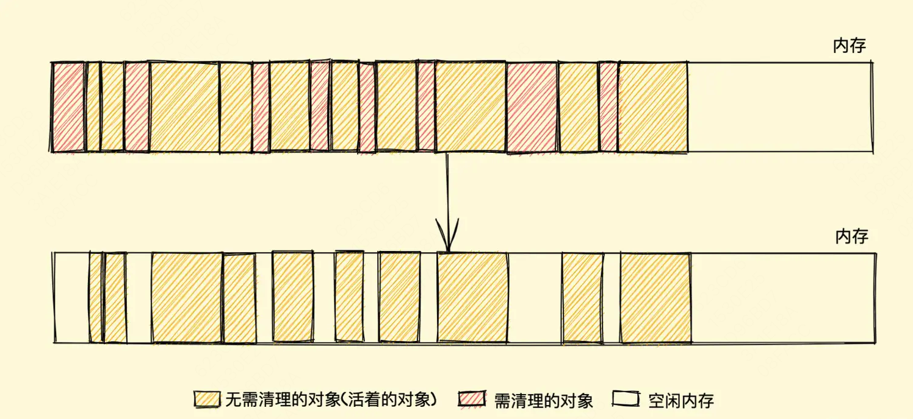
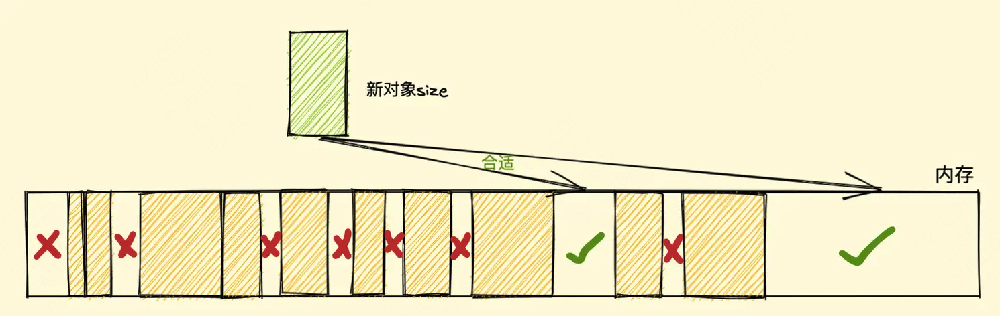
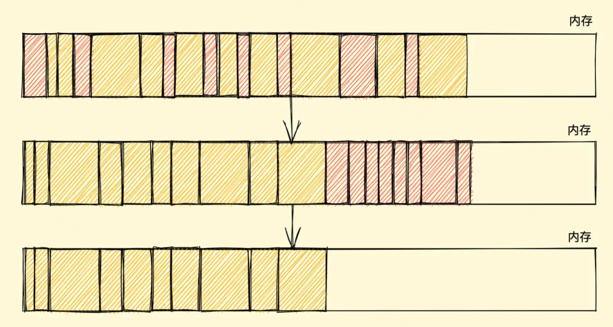
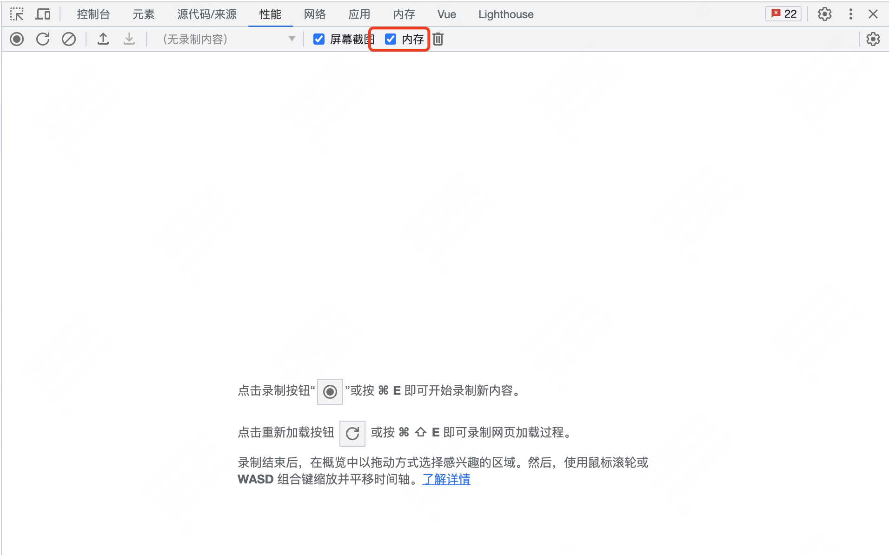
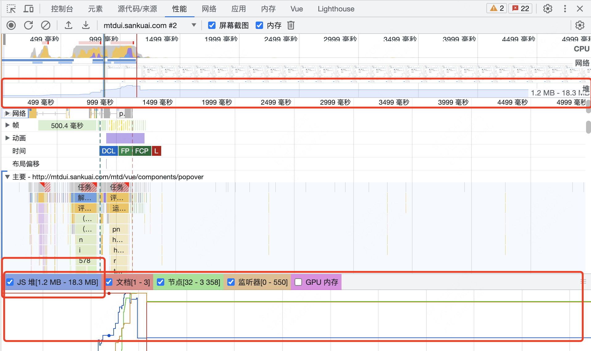
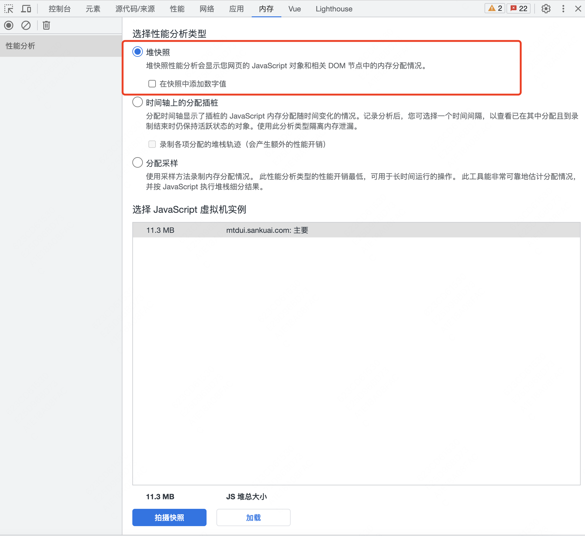
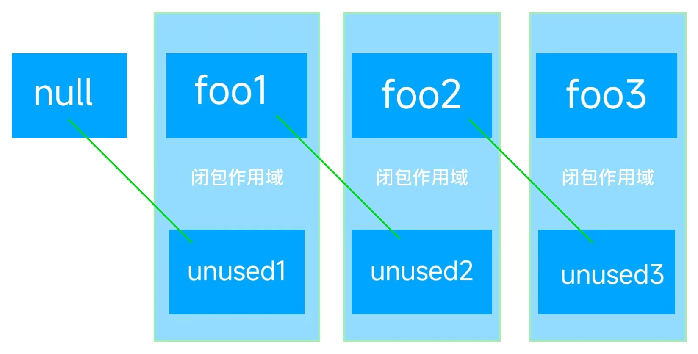

## 前言

JavaScript（以下简称 JS）和其他语言类似，在定义变量后会给变量分配一定的存储空间。当变量不在被使用时进行资源空间的释放，该过程是由 JS 自动执行的，被称之为垃圾回收。我们都知道 JavaScript 是自动进行内存回收的，在平常的开发中，我们也一般不会去关注内存问题。那么是否就意味着我们就不需要了解 Js 的内存回收了呢？ 当然不是， 就像 Java 的内存回收一样，自动内存回收固然大大简化了开发者的工作，但算法策略并不是完美的，总会有各种特殊的情况导致内存无法正常回收。

## 栈和堆

JavaScript 的数据类型有：String、Number、Boolean、Array、Object、Null、Undefined。其中 String、Number、Boolean、Null、Undefined 属于基本类型，Array 和 Object 属于引用类型。

栈是操作系统使用的一种功能，它有大小限制，操作不灵活，它由系统自动分配和释放；而堆是编程语言提供的一种功能，是动态分配的内存，大小不定也不会由系统自动释放。其中：

- 基本类型是存放在栈内存中的简单数据段，分为变量标识和值，均保存在栈内存，变量标识指向其对应的值，数据大小确定，内存空间大小可以分配。

- 引用类型是存放在堆内存中的对象，变量实际保存的是一个指针，这个指针指向另一个位置。每个空间大小不一样，要根据情况开进行特定的分配。

当我们需要访问引用类型（如对象，数组）的值时，首先从栈中获得该对象的地址指针，然后再从堆内存中取得所需的数据。而我们提到的内存泄漏的情况只会发生在堆内存中（从概念可得知）。但是栈和堆都会发生内存溢出。

## 内存生命周期

不管什么程序语言，内存生命周期基本是一致的：

分配你所需要的内存

使用分配到的内存（读、写）

不需要时将其释放\归还

所有语言第二部分都是明确的。第一和第三部分在底层语言中是明确的，但在像 JavaScript 这些高级语言中，大部分都是隐含的。

大多数内存管理的问题都在不需要时将其释放\归还这个阶段。在这里最艰难的任务是找到“哪些被分配的内存确实已经不再需要了”。

## 垃圾回收

寻找是否一些内存“不再需要”的问题是无法判定的。因此，垃圾回收实现只能有限制的解决一般问题。以下将解释必要的概念，了解主要的垃圾回收算法和它们的局限性。我们知道垃圾回收机制是引擎来做的，JS 引擎有很多种（各个浏览器都不同），其垃圾回收机制在一些细节及优化上略有不同。

### 引用计数法

垃圾回收算法主要依赖于引用的概念。在内存管理的环境中，一个对象如果有访问另一个对象的权限（隐式或者显式），叫做一个对象引用另一个对象。例如，一个 Javascript 对象具有对它原型的引用（隐式引用）和对它属性的引用（显式引用）。

引用计数垃圾收集

这是最初级的垃圾收集算法。此算法把“对象是否不再需要”简化定义为“对象有没有其他对象引用到它”。如果没有引用指向该对象（零引用），对象将被垃圾回收机制回收。

```javaScript
var o = {
  a: {
    b: 2,
  },
};
// 两个对象被创建，一个作为另一个的属性被引用，另一个被分配给变量 o
// 很显然，没有一个可以被垃圾收集

var o2 = o; // o2 变量是第二个对“这个对象”的引用

o = 1; // 现在，“这个对象”只有一个 o2 变量的引用了，“这个对象”的原始引用 o 已经没有

var oa = o2.a; // 引用“这个对象”的 a 属性
// 现在，“这个对象”有两个引用了，一个是 o2，一个是 oa

o2 = "yo"; // 虽然最初的对象现在已经是零引用了，可以被垃圾回收了
// 但是它的属性 a 的对象还在被 oa 引用，所以还不能回收

oa = null; // a 属性的那个对象现在也是零引用了
// 它可以被垃圾回收了
```

限制：循环引用

该算法有个限制：无法处理循环引用的事例。在下面的例子中，两个对象被创建，并互相引用，形成了一个循环。它们被调用之后会离开函数作用域，所以它们已经没有用了，可以被回收了。然而，引用计数算法考虑到它们互相都有至少一次引用，所以它们不会被回收。假如此函数在程序中被多次调用，那么就会造成大量的内存不会被释放。

```javaScript
function f() {
  var o = {};
  var o2 = {};
  o.a = o2; // o 引用 o2
  o2.a = o; // o2 引用 o

  return "azerty";
}

f();
```

### 标记 - 清除算法

这个算法把“对象是否不再需要”简化定义为“对象是否可以获得”。此算法分为 标记 和 清除 两个阶段，标记阶段即为所有活动对象做上标记，清除阶段则把没有标记（也就是非活动对象）销毁。这个算法假定设置一个叫做根（root）的对象（在 Javascript 里，根是全局对象）。垃圾回收器将定期从根开始，找所有从根开始引用的对象，然后找这些对象引用的对象……从根开始，垃圾回收器将找到所有可以获得的对象和收集所有不能获得的对象。这个算法比前一个要好，因为“有零引用的对象”总是不可获得的，但是相反却不一定，参考“循环引用”。

从 2012 年起，所有现代浏览器都使用了标记 - 清除垃圾回收算法，只是各大浏览器厂商还对此算法进行了优化加工，且不同浏览器的  JavaScript 引擎   在运行垃圾回收的频率上有所差异。所有对 JavaScript 垃圾回收算法的改进都是基于标记 - 清除算法的改进，并没有改进标记 - 清除算法本身和它对“对象是否不再需要”的简化定义。

缺点

标记清除算法有一个很大的缺点，就是在清除之后，剩余的对象内存位置是不变的，也会导致空闲内存空间是不连续的，出现了 内存碎片（如下图），并且由于剩余空闲内存不是一整块，它是由不同大小内存组成的内存列表，这就牵扯出了内存分配的问题
 
假设我们新建对象分配内存时需要大小为 size，由于空闲内存是间断的、不连续的，则需要对空闲内存列表进行一次单向遍历找出大于等于 size 的块才能为其分配（如下图）
 

那如何找到合适的块呢？我们可以采取下面三种分配策略

- First-fit，找到大于等于 size 的块立即返回
- Best-fit，遍历整个空闲列表，返回大于等于 size 的最小分块
- Worst-fit，遍历整个空闲列表，找到最大的分块，然后切成两部分，一部分 size 大小，并将该部分返回

这三种策略里面 Worst-fit 的空间利用率看起来是最合理，但实际上切分之后会造成更多的小块，形成内存碎片，所以不推荐使用，对于 First-fit 和 Best-fit 来说，考虑到分配的速度和效率 First-fit 是更为明智的选择

综上所述，标记清除算法或者说策略就有两个很明显的缺点

- 内存碎片化，空闲内存块是不连续的，容易出现很多空闲内存块，还可能会出现分配所需内存过大的对象时找不到合适的块
- 分配速度慢，因为即便是使用 First-fit 策略，其操作仍是一个 O(n) 的操作，最坏情况是每次都要遍历到最后，同时因为碎片化，大对象的分配效率会更慢

PS：标记清除算法的缺点补充

归根结底，标记清除算法的缺点在于清除之后剩余的对象位置不变而导致的空闲内存不连续，所以只要解决这一点，两个缺点都可以完美解决了

而 标记整理（Mark-Compact）算法 就可以有效地解决，它的标记阶段和标记清除算法没有什么不同，只是标记结束后，标记整理算法会将活着的对象（即不需要清理的对象）向内存的一端移动，最后清理掉边界的内存（如下图）
 

> 在 IE8 以及更早版本的 IE 中，BOM 和 DOM 对象并非是原生 JavaScript 对象，它是由 C++ 实现的 组件对象模型对象（COM，Component Object Model），而 COM 对象使用 引用计数算法来实现垃圾回收，所以即使浏览器使用的是标记清除算法，只要涉及到 COM 对象的循环引用，就还是无法被回收掉，就比如两个互相引用的 DOM 对象等等，而想要解决循环引用，需要将引用地址置为 null 来切断变量与之前引用值的关系，如下  
> // COM 对象  
> let ele = document.getElementById("xxx")  
> let obj = new Object()  
> // 造成循环引用  
> obj.ele = ele   
> ele.obj = obj  
> // 切断引用关系  
> obj.ele = null  
> ele.obj = null  
> 不过在 IE9 及以后的 BOM 与 DOM 对象都改成了 JavaScript 对象，也就避免了上面的问题  
> 此处参考 JavaScript 高级程序设计 第四版 4.3.2 小节  

### v8 引擎的垃圾回收

v8 引擎对垃圾回收做了更近一步的优化。使用分代式垃圾回收机制，把对象分为新生代和老生代两种类型。对这两部分采用不同的垃圾回收策略。

## 内存泄漏与内存溢出

内存泄漏（Memory Leak）

内存泄漏指由于疏忽或错误造成程序未能释放已经不再使用的内存。程序员认为合理的代码，但实际运行时，随着处理操作或请求，内存会不断上升直到超出程序设置的最大内存，导致程序奔溃。对于有垃圾回收机制的平台，到了接近内存溢出阶段，由于 GC 算法会不断尝试内存回收，系统的 CPU 会急剧提升。内存泄漏的问题，对后端服务或者游戏等长时间运行的程序影响比较大。对于存活时间较短的普通客户端危害较低，但是在 SPA 应用中内存泄漏的危害会被放大。

内存溢出（out of memory）

是指程序在申请内存时，没有足够的内存空间供其使用，出现 out of memory。比方说栈，栈满时再做进栈必定产生空间溢出，叫上溢，栈空时再做退栈也产生空间溢出，称为下溢。就是分配的内存不足以放下数据项序列，称为内存溢出。内存溢出不一定是由内存泄漏引发的，也可能是程序本身申请的内存就不够。
以发生的方式来分类，内存泄漏可以分为 4 类：
- 常发性内存泄漏。发生内存泄漏的代码会被多次执行到，每次被执行的时候都会导致一块内存泄漏。
- 偶发性内存泄漏。发生内存泄漏的代码只有在某些特定环境或操作过程下才会发生。常发性和偶发性是相对的。对于特定的环境，偶发性的也许就变成了常发性的。所以测试环境和测试方法对检测内存泄漏至关重要。
- 一次性内存泄漏。发生内存泄漏的代码只会被执行一次，或者由于算法上的缺陷，导致总会有一块仅且一块内存发生泄漏。
- 隐式内存泄漏。程序在运行过程中不停的分配内存，但是直到结束的时候才释放内存。严格的说这里并没有发生内存泄漏，因为最终程序释放了所有申请的内存。但是对于一个服务器程序，需要运行几天，几周甚至几个月，不及时释放内存也可能导致最终耗尽系统的所有内存。所以，我们称这类内存泄漏为隐式内存泄漏。

从用户使用程序的角度来看，内存泄漏本身不会产生什么危害，作为一般的用户，根本感觉不到内存泄漏的存在。真正有危害的是内存泄漏的堆积，这会最终消耗尽系统所有的内存，最终引发内存溢出。从这个角度来说，一次性内存泄漏并没有什么危害，因为它不会堆积，而隐式内存泄漏危害性则非常大，因为较之于常发性和偶发性内存泄漏它更难被检测到。

## 内存泄漏排查与测试
- 开发者工具 performance
 
 
- 开发者工具 memory
 
- node 环境 heapdump
使用 heapdump 保存内存快照时，只会有 Node.js 环境中的对象，不会受到干扰。
- 手动垃圾回收
垃圾回收并不会时刻进行，通常当 V8 认为时机合适时，才会进行触发垃圾回收。如周期性的触发，或可用内存很紧张时会特殊性调用。JavaScript 的 V8 引擎使用了一套复杂的逻辑来判断那个什么时候垃圾收集应该运行。明白了这个，就会知道尽管我们可以看到用于一个 Node 现成的内存在持续地增涨，我们还是不能确定自己是否目击了一次内存泄露, 直到我们知晓了垃圾收集已经运行起来，让不再被使用的内存可以被清理出来。值得庆幸的是，Node 允许我们手动触发垃圾回收，而这是在尝试确认一个内存泄露问题时我们应该要做的第一件事情。这件事情可以借助在运行  Node 时带上 --expose-gc 标识(例如  node --expose-gc index.js)来完成。一旦 node 以那个模式运行，你就可以用编程的方式通过从你的程序调用 global.gc() 来在任何时刻触发一次垃圾回收。

## 常规的内存泄漏

### 隐式全局变量

全局变量通常不会被回收，我们使用全局变量是 OK 的，但同时我们要避免一些额外的全局变量产生
```javaScript
function fn(){
// 没有声明从而制造了隐式全局变量 test1
test1 = new Array(1000).fill('isboyjc1')

// 函数内部 this 指向 window，制造了隐式全局变量 test2
this.test2 = new Array(1000).fill('isboyjc2')
}
fn()
```
除此之外，我们在程序中也会不可避免的使用全局变量，这些全局变量除非被取消或者重新分配之外也是无法回收的，这也就需要我们额外的关注，也就是说当我们在使用全局变量存储数据时，可以的话将其置空或者重新分配，当然也很简单，在使用完将其置为 null 即可，特别是在使用全局变量做持续存储大量数据的缓存时，我们一定要记得设置存储上限并及时清理，不然的话数据量越来越大，内存压力也会随之增高。

实际使用：

### 不正当的闭包

不是所有的闭包都会产生内存泄漏
```javaScript
var replaceThing = function () {
//为了方便观察内存情况（正常情况下一般是不会有这么长的数组的），new 一个有一亿项元素的数组，这样数组本身会占用很大的内存
var originalThing = new Array(100000).join("this_is_a_big_data");
var outer = 'outer str';
console.log('new...');
return function () {
if (originalThing)
console.log(outer);
};
};
//得到闭包函数
var closureFn = replaceThing();
//执行
closureFn();
```
与其说是闭包的问题，很大一部分原因在于全局变量，我们可以选择不使用全局变量，或者将全局变量置为 null

不使用全局变量：
```javaScript
var replaceThing = function () {
//为了方便观察内存情况，new 一个有一亿项元素的数组，这样数组本身会占用很大的内存
var originalThing = new Array(100000).join("this_is_a_big_data");
var outer = 'outer str';
console.log('new...');
return function () {
if (originalThing)
console.log(outer);
};
};
//得到闭包函数并执行
replaceThing()();
```
全局变量为空
```javaScript
var replaceThing = function () {
//为了方便观察内存情况（正常情况下一般是不会有这么长的数组的），new 一个有一亿项元素的数组，这样数组本身会占用很大的内存
var originalThing = new Array(100000).join("this_is_a_big_data");
var outer = 'outer str';
console.log('new...');
return function () {
if (originalThing)
console.log(outer);
};
};
//得到闭包函数
var closureFn = replaceThing();
//执行
closureFn();
closureFn = null;
```
闭包循环引用
```javaScript
let foo = null;
function outer() {
let bar = foo;
function unused() { // 未使用到的函数
console.log(`bar is ${bar}`);
}

    foo = { // 给foo变量重新赋值
        bigData: new Array(100000).join("this_is_a_big_data"), // 如果这个对象携带的数据非常大，将会造成非常大的内存泄漏
        inner: function() {
            console.log(`inner method run`);
        }
    }

}
for(let i = 0; i < 1000; i++) {
outer();
}
```
首先科普下：在执行函数的时候，如果遇到闭包，会创建闭包作用域内存空间，将该闭包所用到的局部变量添加进去，然后再遇到闭包，会在之前创建好的作用域空间添加此闭包会用到而前闭包没用到的变量。也就是说同一个父级作用域的多个闭包是共享一个闭包作用域的。

闭包作用域共享，闭包作用域是内部所有闭包函数共享的，只要有一个内部函数使用到了外部函数中的变量即可形成闭包。

简而言之，就是发生内存泄漏的原因就在于因为共享闭包作用域的原因，多个闭包作用域形成了链式的依赖，导致所有的内存对象都得不到释放。
 

解决方案 1：手动释放 bar 变量，解除闭包解除 bar 变量对上一次 foo 变量的引用
```javaScript
let foo = null;
function outer() {
let bar = foo;
function unused() { // 未使用到的函数
console.log(`bar is ${bar}`);
}

    foo = { // 给foo变量重新赋值
        bigData: new Array(100000).join("this_is_a_big_data"), // 如果这个对象携带的数据非常大，将会造成非常大的内存泄漏
        inner: function() {
            console.log(`inner method run`);
        }
    }
    bar = null; // 手动释放bar变量，解除bar变量对上一次foo对象的引用

}
for(let i = 0; i < 1000; i++) {
outer();
}
```

解决方案 2：foo 变为非全局变量
```javaScript
(function () {
let foo = null;
function outer() {
let bar = foo;
function unused() {
// 未使用到的函数
console.log(`bar is ${bar}`);
}

    foo = {
      // 给foo变量重新赋值
      bigData: new Array(100000).join("this_is_a_big_data"), // 如果这个对象携带的数据非常大，将会造成非常大的内存泄漏
      inner: function () {
        console.log(`inner method run`);
      },
    };
    bar = null; // 手动释放bar变量，解除bar变量对上一次foo对象的引用

}
for (let i = 0; i < 1000; i++) {
outer();
}
})();
```

### 游离 DOM 引用

```html
<div id="root">
  <ul id="ul">
    <li></li>
    <li></li>
    <li id="li3"></li>
    <li></li>
  </ul>
</div>
<script>
  let root = document.querySelector('#root')
  let ul = document.querySelector('#ul')
  let li3 = document.querySelector('#li3')
  // 由于ul变量存在，整个ul及其子元素都不能GC
  root.removeChild(ul)
  // 虽置空了ul变量，但由于li3变量引用ul的子节点，所以ul元素依然不能被GC
  ul = null
  // 已无变量引用，此时可以GC
  li3 = null
</script>
```

当我们使用变量缓存 DOM 节点引用后删除了节点，如果不将缓存引用的变量置空，依然进行不了 GC，也就会出现内存泄漏。

假如我们将父节点置空，但是被删除的父节点其子节点引用也缓存在变量里，那么就会导致整个父 DOM 节点树下整个游离节点树均无法清理，还是会出现内存泄漏，解决办法就是将引用子节点的变量也置空

### 遗忘的定时器

程序中我们经常会用到计时器
```javaScript
// 获取数据
let someResource = getData()
setInterval(() => {
const node = document.getElementById('Node')
if(node) {
node.innerHTML = JSON.stringify(someResource))
}
}, 1000)
```

在 setInterval 没有结束前，回调函数里的变量以及回调函数本身都无法被回收。什么才叫结束呢？也就是调用了 clearInterval 才会结束。setTiemout 和 requestAnimationFrame 也是如此。

7.5 遗忘的事件监听器

当事件监听器在组件内挂载相关的事件处理函数，而在组件销毁时不主动将其清除时，其中引用的变量或者函数都被认为是需要的而不会进行回收，如果内部引用的变量存储了大量数据，可能会引起页面占用内存过高，这样就造成意外的内存泄漏。
```javaScript
created() {
window.addEventListener("resize", this.doSomething)
},
beforeDestroy(){
window.removeEventListener("resize", this.doSomething)
},
```

### 遗忘的监听者模式
```javaScript
created() {
eventBus.on("test", this.doSomething)
},
beforeDestroy(){
eventBus.off("test", this.doSomething)
},
```

### 未清理的 Console 输出

console  也是一种隐患，同时也是容易被忽略的，我们之所以在控制台能看到数据输出，是因为浏览器保存了我们输出对象的信息数据引用，也正是因此未清理的  console  如果输出了对象也会造成内存泄漏。
```html
<!DOCTYPE html>
<html lang="en">

<head>
  <meta charset="UTF-8">
  <title>test</title>
</head>

<body>
  <button id="click">click</button>
  <script>
    !function () {
      function Test() {
        this.init()
      }
      Test.prototype.init = function () {
        this.a = new Array(10000).fill('isboyjc')
        console.log(this)
      }

      document.querySelector('#click').onclick = function () {
        new Test();
      }
    }()
  </script>
</body>
</html>
```

## JavaScript 内存排查

我们可通过以下方式察觉内存问题：
- 页面的性能随着时间的延长越来越差。 这可能是内存泄漏的症状。 内存泄漏是指，页面中的错误导致页面随着时间的延长使用的内存越来越多。
- 页面的性能一直很糟糕。 这可能是内存膨胀的症状。 内存膨胀是指，页面为达到最佳速度而使用的内存比本应使用的内存多。
- 页面出现延迟或者经常暂停。 这可能是频繁垃圾回收的症状。 垃圾回收是指浏览器收回内存。 浏览器决定何时进行垃圾回收。 回收期间，所有脚本执行都将暂停。因此，如果浏览器经常进行垃圾回收，脚本执行就会被频繁暂停。

您可以使用 Chrome 任务管理器或者 Timeline（新版本已更名为 Performance）内存记录发现频繁的垃圾回收。
- 使用 Chrome 的任务管理器了解您的页面当前正在使用的内存量。内存值频繁上升和下降表示存在频繁的垃圾回收。
- 使用 Timeline（Performance） 记录可视化一段时间内的内存使用。
- 使用堆快照确定已分离的 DOM 树（Detached DOM tree）。

## 如何避免发生内存泄漏

- 尽量避免使用全局变量
- 使用“严格模式”开发，避免因为我们的疏忽导致意外产生全局变量
- 对于一些占用内存较大的对象，在变量不在使用后，手动将其赋值为 null，例如前面例子中的超大的数组
- 尽量避免把外层引用赋予内部变量，例如上面例子中的 theThing 变量


github 仓库
https://github.com/WuT416/JavaScript_summary
参考文档：
https://juejin.cn/post/6981588276356317214
https://www.oschina.net/translate/\simple-guide-to-finding-a-javascript-memory-leak-in-node-js?print
https://segmentfault.com/a/1190000039132414
